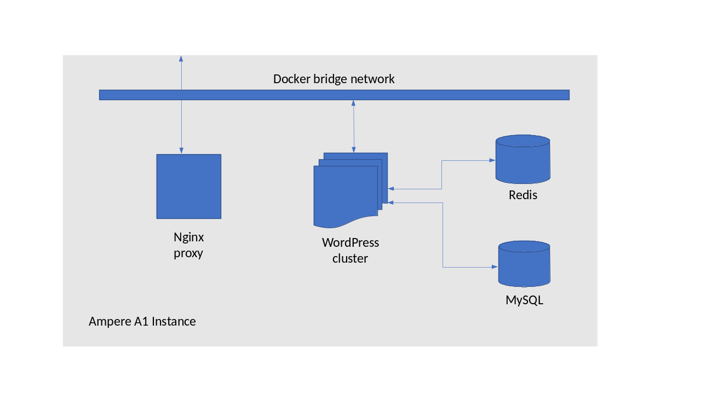

# Welcome to Pi Day 2023!

This hour, we will take a journey through what is involved in putting together
a realistic cloud-native application using Docker containers in a single
Ampere A1 VM instance on Oracle Cloud. By the end of our time together, you
will have:

* Created a Wordpress instance and a separate MySQL instance with some
  reference content
* Added an nginx proxy to enable us to hide the application's internal
  architecture, and make changes to scale our application
* Enable load balancing across multiple WordPress instances
* Installed a caching system which will accelerate the delivery of static
  content
* Added a [Redis object cache](https://redis.io/)  which will reduce the
  amount of compute power used by our web servers
* At each step, we will test the performance of our instance to verify that
  we are improving its performance and scalability

For the purposes of today's presentation, we will do all of these in a single
four-OCPU Ampere Altra A1 instance on the OCI Always Free tier. There are
lots of things we could do to continue to make this application more "cloud
native", including registering for SSL certificates and enabling secure
access over HTTPS, using object storage for uploads rather than saving them
to the filesystem, backing up our database for effective disaster recovery,
adding monitoring to ensure that we stay on top of the load of the
application, and moving our application to a clustered solution based on
Kubernetes.

However, all of this is out of scope for today. By the end of today's session,
you will have a total of six container instances running. We will map port 80
of our VM to port 80 of the nginx container, and use a network bridge to
connect all of our application containers. Our final WordPress architecture
will look like this:



## Prerequisites

Before you get started, you will need an Ampere A1 instance running on
Oracle Cloud.

Throughout this session, we will assume that you are running Oracle Linux 8,
and the tutorial has made this assumption for all commands, file locations,
and usernames.

To create an instance, first sign up to [Oracle Cloud](https://cloud.oracle.com),
and on the dashboard select “Create a VM instance” in the “Launch Resources”
section. We will create the instance in the “root” compartment. In the “Image
and shape” section, we are going to edit the defaults, and under “Shape”, we
will change the shape to choose the Ampere type, with 4 OCPUs and 12 GB of RAM –
this will max out your “Always Free” quota.

If you already have another VM running on OCI, you can certainly complete this
tutorial with a smaller instance, but you will increase resource contention as
we increase the number of containers.

Choosing the Ampere family:


Sizing the instance:


You will also need to modify the Virtual Cloud Network settings for the
instance to enable HTTP and HTTPS traffic and get a public IPv4 address. Then
generate an SSH key pair (or upload the public key to one you already have) to
allow you to connect to the instance over SSH.

Once you have completed these settings, you can click “Create” to start your
instance. When you click on your instance name, you can find its public IP
address for connections.

You can also automate the creation of instances using a tool like Terraform –
we provide
[Terraform files and tutorials](ihttps://github.com/amperecomputing/terraform-oci-ampere-a1)
on Ampere’s github page to help.

Once you have your instance running Oracle Linux, there are a few things we will
need to install to ensure that we can run docker-compose to launch our application.

1. As root, install Docker, and updating operating system packages:
```
sudo -s
dnf install -y yum-utils
yum-config-manager --add-repo https://download.docker.com/linux/centos/docker-ce.repo
dnf update -y && dnf install -y docker-ce docker-ce-cli containerd.io
```
2. Enable the Docker service, and ensure that the opc user can run it:
```
systemctl start docker && systemctl enable docker
usermod -aG docker opc
sudo -s -u opc
```
3. Now check that the opc user is in the docker group, and has permission to run Docker:
```
groups
docker run hello-world
```
4. Download and install `docker-compose`:
  * Check [the docker-compose releases page](https://github.com/docker/compose/releases)
    for more recent releases. Make sure you choose the `linux-aarch64` binary

```
sudo curl -L https://github.com/docker/compose/releases/download/v2.16.0/docker-compose-linux-aarch64 -o /usr/local/bin/docker-compose && sudo chmod +x /usr/local/bin/docker-compose
```
5. Finally, we will install `git` and download the repository for today's session:
```
sudo dnf install -y git
git clone https://github.com/dneary/pi-day-tutorial
```

We now have everything we need to get started! We will build up in stages. In stage 1,
we will start a new WordPress instance from scratch, and go through the installation
process. In stage 2, we will pre-load some content (including this post and
documentation for this session!) to our WordPress instance, and add an nginx proxy
to pass through connections. In stage 3, we will start another two WordPress instances
and configure nginx to load balance across them. Finally, in stage 4, we will add a
caching plug-in to WordPress, start a Redis instance, and configure WordPress to use
Redis as an object cache.

[Let's get started!](wordpress1/)

